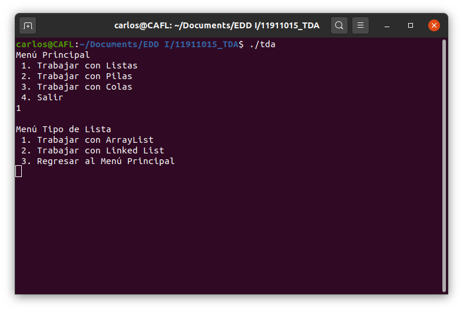

# Proyecto 1 EDD I
## Manual de usuario
### Carlos Alberto Fortín Larios 11911015

## Índice

1. Introducción
2. TDA's
    - Lista
    - Pila
    - Cola
3. Menú principal
    - Menú TDA lista
        - Opciones de la lista
    - Menú TDA pila
        - Opciones de la pila
    - Menú TDA cola
        - Opciones de la cola

# Introducción
Este proyecto fue desarrollado para poder trabajar con los tipos de datos abstractos
lista, pila y cola. Usted podrá trabajar con los tres tipos de datos en dos tipos de
implementaciones: con arreglos y con nodos doblemente enlazados.

# TDA's
## Lista
La lista es un tipo de dato abstracto flexible, ya que puede crecer y encogerse según
se requiera. Los elementos se pueden acceder, insertar y suprimir en cualquier posición
válida en la lista.

## Pila
La pila es un tipo especial de la lista en la que todas las inserciones y supreciones
siguen la regla de LIFO (last in, first out) o último en entrar, primero en salir.

## Cola
La cola es un tipo especial de la lista en la que las inserciones y supreciones siguien
la regla FIFO (first in, first out) o primero en entrar, primero en salir.

# Menú Principal

Menú Principal

## Opción 1: Trabajar con listas
Al seleccionar la primera opción el programa nos mostrará el menú de listas

Una vez en este menú podemos elegir si deseamos trabajar con una ArrayList o con una LinkedList.
Al seleccionar cualquiera de las dos primeras opciones el programa nos mostrará las opciones de listas.
La tercera opción nos regresará al menú principal.

### Opciones de la lista

1. Insertar elemento
    
    Se le pedirá al usuario que ingrese el nombre y el número de cuenta del alumno que ingresará y después la posición en la que desea ingresarlo. Una vez hecho esto se le notificará si se pudo ingresar exitósamente el elemento o no y se le preguntará si desea ingresar otro elemento. Si selecciona no ('n') se le regresará al menú de opciones de la lista.

2. Imprimir elementos

    Se imprimirán los elementos que están en la lista en el orden en el que aparezcan. Si la lista está vacía se le indicará.

3. Buscar elemento

    Se le pedirá al usuario que ingrese el número de cuenta del alumno que desea buscar. El programa buscará el elemento que tenga ese dato. Si lo encuentra se le indicará la posición en la que está el elemento, sino se verá un mensaje diciendo que el elemento no está en la lista.

4. Borrar elemento

    Se le pedirá al usuario que ingrese la posición en la que se encuentra el elemento que desea eliminar. Si la posición es válida se mostrará el elemento borrado, sino se indicará que no se pudo eliminar el usuario en la posición ingresada.

5. Ver si está vacía

    Se indicará si la lista está vacía o no.

6. Obtener elemento por posición

    Se le pedirá al usuario que ingrese la posición de la que quiere conseguir el elemento. Si la posición es válida se mostrará el elemento en esa posición, sino se indicará que no se pudo.

7. Obtener siguiente

    Se le pedirá al usuario que ingrese la posición de la que quiere conseguir el elemento siguiente. Si la posición es válida se mostrará el elemento en esa posición, sino se indicará que no se pudo.

8. Obtener anterior

    Se le pedirá al usuario que ingrese la posición de la que quiere conseguir el elemento anterior. Si la posición es válida se mostrará el elemento en esa posición, sino se indicará que no se pudo.

9. Borrar todos los elementos

    Se limpiará la lista dejandola sin elementos.

10. Regresar al menú principal

    Se regresa al menú principal.

## Opción 2: Trabajar con pilas

Una vez en este menú podemos elegir si deseamos trabajar con una ArrayStack o con una LinkedStack.
Al seleccionar cualquiera de las dos primeras opciones el programa nos mostrará las opciones de pilas.
La tercera opción nos regresará al menú principal.

### Opciones de la pila

1. Empujar

    Se le pedirá al usuario que ingrese un símbolo para "empujar" a la pila.

2. Sacar

    Se "sacará" de la pila el último elemento que se empujó, mostrándolo en la pantalla. Si la pila está vacía se le informará.

3. Ver tope

    Se mostrará en pantalla el elemento que está en el tope de la pila. Si la pila está vacía se le informará.

4. Verificar si está vacía

    Se indicará si la pila está vacía o no.

5. Imprimir elementos

    Se imprimirán los elementos de la pila en el orden de salida. Si la pila está vacía se le informará.

6. Regresar al menú principal

    Se regresa al menú principal.

## Opción 3: Trabajar con colas

Una vez en este menú podemos elegir si deseamos trabajar con una ArrayQueue o con una LinkedQueue.
Al seleccionar cualquiera de las dos primeras opciones el programa nos mostrará las opciones de colas.
La tercera opción nos regresará al menú principal.

### Opciones de la cola

1. Encolar

    Se le pide al usuario que ingrese el nombre y el número de cuenta del alumno que desea poner en la cola.

2. Desencolar

    Se sacará de la cola y mostrará el alumno que seguia en la cola. Si la cola está vacía se le informará.

3. Ver tope

    Se mostrará en pantalla el alumno que sigue en la cola sin quitarlo de esta misma. Si la cola está vacía se le informará.

4. Verificar si está vacía

    Se indicará si la cola está vacía o no.

5. Imprimir elementos

    Se imprimiran en pantalla los elementos de la cola en el orden de salida. Si la cola está vacía se le informará.

6. Regresar al menú principal

    Se regresa al menú principal.

## Opción 4: Salir

Se sale del programa.

